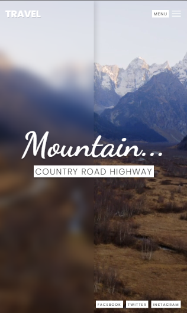

# ScratchandGlassmorphism
Pagina Responsiva com efeito Scratch e técnica de Glassmorphism. Efeito Blur de transparência e elegancia. O tema consiste em uma viagem dos sonhos. 🛥

## DESKTOP 🖥️

---
## MOBILE 📲

Feito com 💚 por <a href="https://www.linkedin.com/in/diego-henrique-reports">Diego Henrique</a>